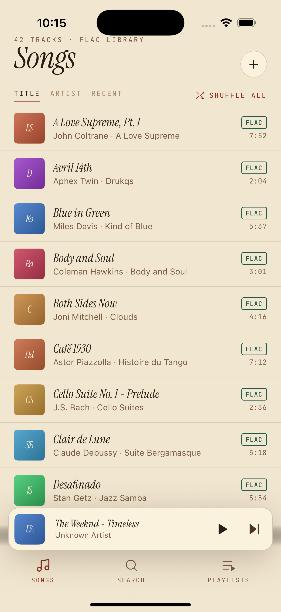
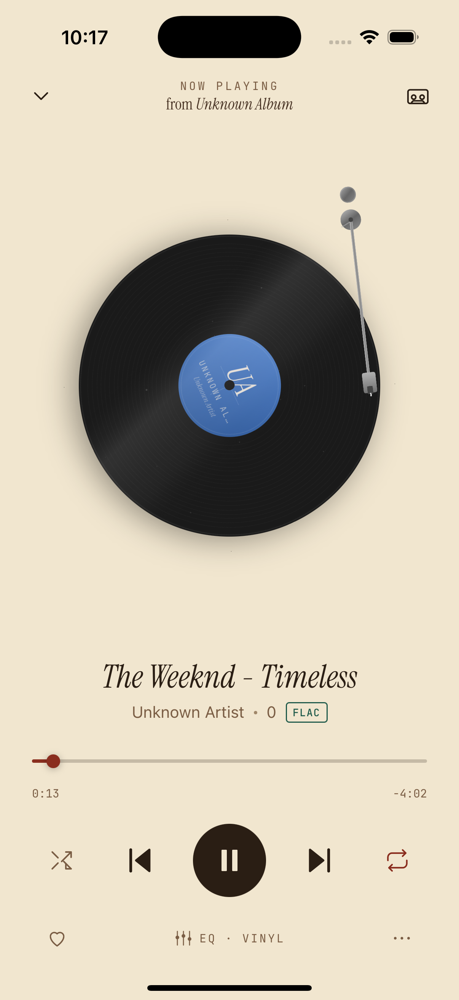
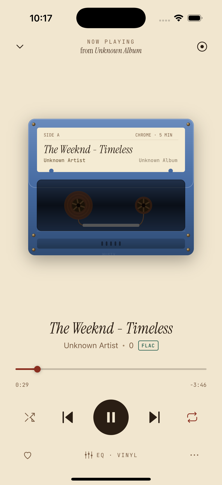

# Musix

Audiophile-grade lossless music player for iOS and Android. Built with React Native New Architecture, Turbo Modules, and a shared C++ audio engine.

Musix plays FLAC, ALAC, and WAV files with gapless playback, a 10-band parametric equalizer, and nostalgic vinyl/cassette player visualizations.

<p align="center">
  
  &nbsp;&nbsp;
  
  &nbsp;&nbsp;
  
</p>

## Features

- **Lossless playback** -- FLAC, ALAC, and WAV with bit-perfect decoding
- **Gapless transitions** -- pre-buffered next track for seamless listening
- **10-band parametric EQ** -- Studio, Vinyl, and Default presets with real-time DSP
- **Vinyl player** -- spinning record at 33 1/3 RPM, tonearm tracks song progress, spin-up acceleration, dust specks, fixed specular highlight
- **Cassette player** -- tape transfers between reels with progress, bezier tape path, wound tape rings, embossed details
- **Library management** -- playlists, liked songs, search, sort by title/artist/recent
- **Background playback** -- audio continues with screen locked
- **Theme system** -- light/dark mode with 5 accent colors
- **Resume state** -- pick up exactly where you left off after app restart

## Architecture

```
musix/
  app/                    # React Native application
    src/
      components/         # UI components (TrackRow, MiniPlayer, VinylPlayer, CassettePlayer...)
      screens/            # SongsScreen, NowPlayingScreen, EqualizerScreen...
      store/              # Zustand stores (Player, Library, Playlist, EQ, Theme)
      db/                 # OP-SQLite schema and query helpers
      theme/              # Design tokens, palette, fonts
  packages/
    audio-engine/         # Native Turbo Modules
      src/
        cpp/              # Shared C++ core (AudioPlayer, BiquadEQ, ring buffer)
        ios/              # AVAudioEngine output, Obj-C++ module bindings
      android/            # Oboe AAudio output, Kotlin module bindings
      js/                 # TypeScript interfaces (PlayerModule, ScannerModule, EQModule)
  docs/
    HLD.md                # High-level design document
    PLAN.md               # Implementation phases
```

## Tech Stack

| Layer | Technology |
|-------|-----------|
| Framework | React Native 0.79 (New Architecture) |
| State | Zustand |
| Persistence | OP-SQLite (library/playlists), MMKV v2 (preferences/resume) |
| Audio decoding | C++ with TagLib, libFLAC |
| Audio output | AVAudioEngine (iOS), Oboe AAudio (Android) |
| DSP | 10-band IIR biquad filter chain (C++) |
| Animation | Reanimated 3 (vinyl), Skia (cassette) |
| Navigation | React Navigation 7 |
| Package manager | pnpm 11 |

## Getting Started

### Prerequisites

- Node.js 18+
- pnpm 11+
- Xcode 15+ (iOS)
- Android Studio + NDK (Android)
- CocoaPods

### Install

```sh
# Clone the repo
git clone git@github.com:Daggron/musix.git
cd musix

# Install dependencies
pnpm install

# Install iOS pods
cd app/ios && pod install && cd ../..
```

### Run

```sh
# iOS
cd app && npx react-native run-ios

# Android
cd app && npx react-native run-android
```

### Development

```sh
# Type check
cd app && npx tsc --noEmit

# Run tests
cd app && npx jest
```

## Adding Music

Musix plays lossless audio files stored on your device. On first launch, you can import files through the Add Music screen (tap the + button). Supported formats:

- **FLAC** -- Free Lossless Audio Codec (up to 24-bit/192kHz)
- **ALAC** -- Apple Lossless Audio Codec
- **WAV** -- Uncompressed PCM audio

## Contributing

Contributions are welcome! Here's how to get started.

### Development Workflow

1. Fork the repo and create a feature branch from `main`
2. Follow the [Getting Started](#getting-started) steps to set up your environment
3. Make your changes, keeping commits focused and descriptive
4. Run type checking (`npx tsc --noEmit`) and tests (`npx jest`) before pushing
5. Open a pull request against `main`

### Code Guidelines

- **TypeScript strict mode** -- no `any` types
- **No comments** unless explaining a non-obvious "why"
- **No Expo** -- this is a bare React Native project
- **Prefer editing existing files** over creating new ones
- **Keep functions small and focused**
- Follow the existing design tokens from `docs/HLD.md` for any UI work

### Project Structure

- **UI changes** go in `app/src/components/` or `app/src/screens/`
- **State logic** goes in `app/src/store/`
- **Database queries** go in `app/src/db/`
- **Native audio code** goes in `packages/audio-engine/`
- **Turbo Module interfaces** are the contract between JS and native -- changes need discussion

### Testing

- **JS:** Jest + React Native Testing Library
- **iOS native:** XCTest
- **Android native:** JUnit
- Run tests before every commit

### Architecture Decisions

Before making structural changes (new patterns, interface modifications, dependency additions), please open an issue to discuss. See `docs/HLD.md` for the current architecture and `docs/PLAN.md` for the implementation roadmap.

### Reporting Issues

- Use GitHub Issues
- Include device/OS version, steps to reproduce, and expected vs actual behavior
- For audio playback issues, include the file format, bit depth, and sample rate

## License

MIT
